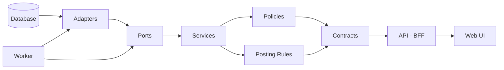

# AIBOS ERP - Dependency & Lineage Guardrails

## 📋 Table of Contents

1. [Overview](#overview)
2. [Architecture Flow](#architecture-flow)
3. [Layer Definitions](#layer-definitions)
4. [Enforcement Mechanisms](#enforcement-mechanisms)
5. [Compliance Rules](#compliance-rules)
6. [Tools & Commands](#tools--commands)
7. [CI/CD Integration](#cicd-integration)
8. [Troubleshooting](#troubleshooting)
9. [Best Practices](#best-practices)

---

## Overview

This document serves as the **single source of truth** for dependency management, lineage tracking, and architectural compliance in the AIBOS ERP system.

### Purpose

- **Prevent drift**: Enforce clean architecture boundaries
- **Track lineage**: Map data and code dependencies from DB to UI
- **Identify issues**: Detect orphan files, circular dependencies, and violations
- **Enable DX**: Provide visual, up-to-date insights for developers

### Key Principles

1. **Clean Architecture**: Each layer has specific responsibilities
2. **Dependency Inversion**: High-level modules don't depend on low-level modules
3. **SSOT Compliance**: All dependencies must follow the canonical flow
4. **Zero Violations**: Architecture violations fail CI/CD
5. **Continuous Monitoring**: Reports regenerated on every PR

---

## Architecture Flow

The **canonical architecture flow** enforced across AIBOS:

```
DB → Adapters → Ports → Services → Policies/PostingRules → Contracts → API (BFF) → UI/Worker
```

### Flow Diagram



### Why This Flow?

- **Separation of Concerns**: Each layer has a single responsibility
- **Testability**: Mock dependencies at layer boundaries
- **Maintainability**: Changes in one layer don't cascade
- **Scalability**: Add new features without breaking existing code

---

## Layer Definitions

Each layer is strictly defined with clear boundaries.

### 1. **DB Layer** 🗄️

**Path**: `packages/adapters/db/**`

**Responsibility**: Database schema, migrations, ORM configuration

**Allowed Dependencies**: None (foundation layer)

**Examples**:

- `packages/adapters/db/schema/accounts.ts`
- `packages/adapters/db/migrations/*.sql`
- `packages/adapters/db/drizzle.config.ts`

**Rule**: DB layer is the **foundation**. No imports from other layers.

---

### 2. **Adapters Layer** 🔌

**Path**: `packages/adapters/**`

**Responsibility**: External system integrations, database access

**Allowed Dependencies**: `DB`, `Ports`, `Contracts`

**Examples**:

- `packages/adapters/db/repositories/*.ts`
- `packages/adapters/stripe/*.ts`
- `packages/adapters/email/*.ts`

**Rule**: Adapters **implement** interfaces from Ports layer.

---

### 3. **Ports Layer** 🔌

**Path**: `packages/ports/**`

**Responsibility**: Dependency inversion interfaces (contracts for adapters)

**Allowed Dependencies**: `Contracts`

**Examples**:

- `packages/ports/IEmailService.ts`
- `packages/ports/IPaymentGateway.ts`
- `packages/ports/IRepository.ts`

**Rule**: Define **interfaces**, not implementations.

---

### 4. **Services Layer** ⚙️

**Path**: `packages/services/**`

**Responsibility**: Core business logic, domain operations

**Allowed Dependencies**: `Ports`, `Contracts`, `Policies`, `PostingRules`

**Examples**:

- `packages/services/src/posting-invoice.ts`
- `packages/services/src/reconciliation.ts`
- `packages/services/src/tax-calculation.ts`

**Rule**: Business logic goes here. Services **never** import from Adapters directly (use Ports).

---

### 5. **Policies Layer** 📜

**Path**: `packages/policies/**`

**Responsibility**: Business rules, validation policies, approval workflows

**Allowed Dependencies**: `Contracts`

**Examples**:

- `packages/policies/src/approval-policies.ts`
- `packages/policies/src/tax-policies.json`
- `packages/policies/src/compliance-rules.ts`

**Rule**: Declarative business rules. No side effects.

---

### 6. **Posting Rules Layer** 📒

**Path**: `packages/posting-rules/**`

**Responsibility**: Accounting posting rules (debit/credit logic)

**Allowed Dependencies**: `Contracts`

**Examples**:

- `packages/posting-rules/*.json5`
- `packages/posting-rules/src/validators.ts`

**Rule**: Domain-specific accounting rules. JSON5 configuration + validators.

---

### 7. **Contracts Layer** 📋

**Path**: `packages/contracts/**`

**Responsibility**: API contracts, types, schemas (shared across layers)

**Allowed Dependencies**: None (shared foundation)

**Examples**:

- `packages/contracts/src/account.ts`
- `packages/contracts/src/invoice.ts`
- `packages/contracts/openapi/openapi.json`

**Rule**: **Pure types**. No business logic, no imports from other layers.

---

### 8. **API Layer (BFF)** 🚀

**Path**: `apps/bff/app/api/**`

**Responsibility**: Backend for Frontend, API routes, request handling

**Allowed Dependencies**: `Services`, `Contracts`, `Policies`, `PostingRules`, `Adapters`, `Ports`

**Examples**:

- `apps/bff/app/api/accounts/route.ts`
- `apps/bff/app/api/invoices/[id]/route.ts`

**Rule**: Thin layer. Orchestrate services, handle HTTP concerns.

---

### 9. **UI Layer (Web)** 🎨

**Path**: `apps/web/**`

**Responsibility**: Frontend UI, pages, components

**Allowed Dependencies**: `Contracts`, `API Client`

**Examples**:

- `apps/web/app/dashboard/page.tsx`
- `apps/web/components/AccountCard.tsx`

**Rule**: **Never** import from Services or DB directly. Use API client.

---

### 10. **Worker Layer** ⚙️

**Path**: `apps/worker/**`

**Responsibility**: Background jobs, cron tasks, async processing

**Allowed Dependencies**: `Adapters`, `Ports`

**Examples**:

- `apps/worker/src/jobs/reconciliation.ts`
- `apps/worker/src/cron/daily-close.ts`

**Rule**: Long-running tasks. Direct DB access allowed via Adapters.

---

## Enforcement Mechanisms

### 1. **ESLint Plugin Boundaries** ⚡

**Configuration**: `eslint.config.js`

**What It Does**: Static analysis to enforce layer boundaries at compile time.

**Example Violation**:

```typescript
// ❌ BAD: UI importing from Services
import { createInvoice } from '@aibos/services';

// ✅ GOOD: UI using API client
import { apiClient } from '@aibos/api-client';
await apiClient.invoices.create(data);
```

**How to Fix**:

```bash
pnpm lint           # Shows violations
pnpm lint --fix     # Auto-fix where possible
```

---

### 2. **Dependency Cruiser** 🚢

**Configuration**: `.dependency-cruiser.js`

**What It Does**: Enterprise-grade runtime analysis of actual import statements with hexagonal architecture enforcement.

**Features**:

- ✅ Hexagonal/Clean Architecture enforcement (7 layers of rules)
- ✅ Detects circular dependencies
- ✅ Validates module boundaries (apps, packages, scripts)
- ✅ Generates visual dependency graphs with dark theme
- ✅ Checks for orphan modules
- ✅ Security rules (no dist imports, no dev deps in prod)
- ✅ Port/Adapter pattern validation
- ✅ Contract purity enforcement
- ✅ Test isolation (no importing test files in production)

**Enterprise Validation Commands**:

```bash
# Architecture Validation
pnpm arch:validate         # Validate architecture boundaries (error output)
pnpm arch:validate:text    # Human-readable text output
pnpm arch:validate:json    # Machine-readable JSON output
pnpm arch:ci               # CI/CD validation (exits with error on violations)

# Visual Reports
pnpm arch:graph            # Generate dependency graph (SVG)
pnpm arch:graph:png        # Generate dependency graph (PNG)
pnpm arch:archi            # High-level architecture view
pnpm arch:layers           # Focus on contracts/services/adapters layers
pnpm arch:html             # Interactive HTML report

# All-in-One
pnpm arch:report           # Generate JSON + SVG + HTML reports

# Legacy Commands (still supported)
pnpm deps:analyze          # Analyze all dependencies
pnpm deps:circular         # Find circular dependencies only
pnpm deps:graph            # Generate SVG graph (madge-based)
```

---

### 3. **Custom Dependency Mapper** 🗺️

**Script**: `scripts/dependency-mapper.mjs`

**What It Does**: End-to-end lineage mapping from DB to UI with violation reporting.

**Output**:

- JSON: Machine-readable graph
- HTML: Interactive dashboard
- Mermaid: Visual diagram

**Commands**:

```bash
pnpm deps:map              # Generate JSON map (fails on violations)
pnpm deps:html             # Generate HTML report (8 samples, no fail)
pnpm deps:mermaid          # Generate Mermaid diagram
pnpm deps:report:ci        # CI-grade strict validation
```

---

### 4. **SQL Lineage Analyzer** 🗄️

**Script**: `scripts/data-lineage-analyzer.mjs`

**What It Does**: Tracks database table relationships and data flow.

**Analyzes**:

- Foreign key constraints
- JOIN operations
- INSERT INTO ... SELECT patterns
- CREATE TABLE AS SELECT
- Views and materialized views

**Commands**:

```bash
pnpm deps:lineage          # Generate SQL lineage report
```

---

### 5. **Unified Dashboard** 📊

**Script**: `scripts/generate-dashboard.mjs`

**What It Does**: Consolidates all reports into a single HTML dashboard.

**Features**:

- Health score (0-100)
- Violation summary
- Orphan file list
- SQL lineage overview
- Quick action links

**Commands**:

```bash
pnpm deps:dashboard        # Generate dashboard
pnpm deps:view             # Open in browser
```

---

## Compliance Rules

### ✅ DO

1. **Follow the canonical flow**: DB → Adapters → Ports → Services → Policies → Contracts → API → UI
2. **Use Ports for adapters**: Services import from Ports, not Adapters
3. **Keep Contracts pure**: No business logic, only types
4. **Use API client in UI**: Never import Services directly
5. **Run reports before PR**: `pnpm deps:report`
6. **Fix violations immediately**: Don't commit with violations

### ❌ DON'T

1. **Skip layers**: Don't go directly from DB to API
2. **Create circular dependencies**: A → B → A is forbidden
3. **Import from lower layers**: Higher layers can't import from lower layers in reverse
4. **Mix concerns**: Keep business logic in Services, not in API routes
5. **Ignore orphan files**: Remove unused code or wire it correctly
6. **Disable enforcement**: Don't use `eslint-disable` for boundary rules

---

## Tools & Commands

### Quick Reference

| Command                     | Purpose                          | Output                  |
| --------------------------- | -------------------------------- | ----------------------- |
| **Architecture Validation** |                                  |                         |
| `pnpm arch:validate`        | Validate architecture boundaries | Terminal (errors)       |
| `pnpm arch:validate:text`   | Human-readable violations        | Terminal (text)         |
| `pnpm arch:validate:json`   | Machine-readable violations      | JSON file               |
| `pnpm arch:graph`           | Dependency graph visualization   | SVG                     |
| `pnpm arch:layers`          | Layer-focused graph              | SVG                     |
| `pnpm arch:html`            | Interactive violation report     | HTML                    |
| `pnpm arch:report`          | All architecture reports         | JSON + SVG + HTML       |
| `pnpm arch:ci`              | CI/CD validation                 | Exit code               |
| **Dependency & Lineage**    |                                  |                         |
| `pnpm deps:report`          | Generate all reports             | JSON + HTML + Dashboard |
| `pnpm deps:view`            | Open dashboard                   | Browser                 |
| `pnpm deps:analyze`         | Run dependency-cruiser           | Terminal                |
| `pnpm deps:circular`        | Find circular deps               | Terminal                |
| `pnpm deps:map`             | Generate dependency map          | JSON                    |
| `pnpm deps:html`            | Generate HTML report             | HTML                    |
| `pnpm deps:lineage`         | SQL lineage analysis             | JSON                    |
| `pnpm deps:dashboard`       | Unified dashboard                | HTML                    |
| **Code Quality**            |                                  |                         |
| `pnpm lint`                 | Check boundaries                 | Terminal                |
| `pnpm typecheck`            | Type checking                    | Terminal                |
| `pnpm docs:diagrams`        | Generate architecture diagram    | SVG                     |

### Full Workflow

```bash
# 1. Make code changes
# ... edit files ...

# 2. Validate architecture boundaries
pnpm arch:validate

# 3. Generate all reports
pnpm deps:report
pnpm arch:report

# 4. View dashboard
pnpm deps:view

# 5. Fix any violations
pnpm lint --fix

# 6. Verify compliance
pnpm arch:ci          # Architecture compliance
pnpm typecheck        # Type safety
pnpm test             # Unit tests

# 7. Commit
git add .
git commit -m "feat: implement feature X"
```

---

## CI/CD Integration

### GitHub Actions Example

```yaml
name: Architecture Compliance

on:
  pull_request:
    branches: [main, master]

jobs:
  architecture-validation:
    runs-on: ubuntu-latest
    steps:
      - uses: actions/checkout@v4

      - name: Setup Node.js
        uses: actions/setup-node@v4
        with:
          node-version: '22'

      - name: Setup pnpm
        uses: pnpm/action-setup@v2
        with:
          version: 10

      - name: Install dependencies
        run: pnpm install

      - name: Validate Architecture Boundaries
        run: pnpm arch:ci

      - name: Run Dependency Analysis
        run: |
          pnpm deps:report
          pnpm arch:report

      - name: Code Quality Checks
        run: |
          pnpm lint
          pnpm typecheck

      - name: Upload Reports
        if: always()
        uses: actions/upload-artifact@v4
        with:
          name: architecture-reports
          path: |
            reports/
            reports/arch-violations.json
            reports/arch-violations.html
            reports/arch-dependency-graph.svg

      - name: Check for Violations
        run: |
          # Check dependency mapper violations
          VIOLATIONS=$(jq '.graph.summary.violationCount' reports/dependency-map.json)
          if [ "$VIOLATIONS" -gt 0 ]; then
            echo "❌ $VIOLATIONS architecture violations found"
            exit 1
          fi

          # Check architecture violations (JSON output)
          if [ -f reports/arch-violations.json ]; then
            ARCH_ERRORS=$(jq '[.violations[] | select(.rule.severity == "error")] | length' reports/arch-violations.json)
            if [ "$ARCH_ERRORS" -gt 0 ]; then
              echo "❌ $ARCH_ERRORS architecture boundary violations found"
              exit 1
            fi
          fi

          echo "✅ No violations detected"
```

### Pre-commit Hook

```bash
# .husky/pre-commit
#!/bin/sh
. "$(dirname "$0")/_/husky.sh"

echo "🔍 Running dependency checks..."
pnpm deps:circular

if [ $? -ne 0 ]; then
  echo "❌ Circular dependencies detected. Commit blocked."
  exit 1
fi

echo "✅ Dependency checks passed"
```

---

## Troubleshooting

### Common Issues

#### 1. **Violation: UI importing from Services**

**Problem**:

```typescript
// apps/web/components/Invoice.tsx
import { createInvoice } from '@aibos/services'; // ❌
```

**Solution**:

```typescript
// Use API client instead
import { apiClient } from '@aibos/api-client'; // ✅
await apiClient.invoices.create(data);
```

---

#### 2. **Circular Dependency Detected**

**Problem**:

```
A → B → C → A
```

**Solution**:

1. Identify the cycle: `pnpm deps:circular`
2. Extract shared code to a new module
3. Use dependency inversion (interfaces)

---

#### 3. **Orphan Files Detected**

**Problem**: Files with no imports/exports

**Solution**:

1. Check if file is actually used
2. If yes: Import it from appropriate consumer
3. If no: Delete the file

---

#### 4. **Missing Dependency in package.json**

**Problem**: Import from package not in dependencies

**Solution**:

```bash
pnpm add <package-name>
```

---

#### 5. **Mermaid CLI Not Found**

**Problem**: `mmdc: command not found`

**Solution**:

```bash
pnpm install -D @mermaid-js/mermaid-cli
```

---

## Best Practices

### 1. **Layer Responsibilities**

Each layer has **ONE** job:

| Layer     | Job                         | Test Strategy               |
| --------- | --------------------------- | --------------------------- |
| DB        | Store data                  | Integration tests           |
| Adapters  | Connect to external systems | Mocked in unit tests        |
| Ports     | Define contracts            | No tests (just types)       |
| Services  | Business logic              | Unit tests (mock ports)     |
| Policies  | Validate rules              | Unit tests (pure functions) |
| Contracts | Share types                 | Type tests                  |
| API       | HTTP handling               | Integration tests           |
| UI        | User interface              | E2E tests                   |

---

### 2. **Dependency Direction**

**CRITICAL**: Import direction in dependency-cruiser is `"who imports" → "what it imports"`:

```
✅ ALLOWED (correct direction):
API → Services       # API imports from Services
Services → Ports     # Services import from Ports
Adapters → DB        # Adapters import from DB
UI → Contracts       # UI imports from Contracts

❌ FORBIDDEN (reverse direction):
Services → API       # Services should NOT import from API
Ports → Services     # Ports should NOT import from Services
DB → Adapters        # DB should NOT import from Adapters
Contracts → UI       # Contracts should NOT import from UI
```

**Key principle**: Lower layers should NOT know about higher layers.

---

### 3. **Interface Segregation**

Keep interfaces small and focused:

```typescript
// ❌ BAD: God interface
interface IRepository {
  createAccount(...): Promise<Account>;
  updateAccount(...): Promise<void>;
  deleteAccount(...): Promise<void>;
  findInvoice(...): Promise<Invoice>;
  updateInvoice(...): Promise<void>;
  // ... 50 more methods
}

// ✅ GOOD: Segregated interfaces
interface IAccountRepository {
  create(...): Promise<Account>;
  update(...): Promise<void>;
  delete(...): Promise<void>;
}

interface IInvoiceRepository {
  find(...): Promise<Invoice>;
  update(...): Promise<void>;
}
```

---

### 4. **Avoid Circular Dependencies**

Use these patterns to break cycles:

**Pattern 1: Extract to Lower Layer**

```typescript
// If A → B and B → A, extract shared code to new module C
// Then: A → C, B → C
```

**Pattern 2: Dependency Inversion**

```typescript
// If Service A needs Service B, use an interface
// Service A → IServiceB ← Service B
```

**Pattern 3: Event-Driven**

```typescript
// Instead of direct import, use events
// Service A → Event Bus ← Service B
```

---

### 5. **Report Hygiene**

- **Daily**: Check dashboard for new violations
- **Before PR**: Run `pnpm deps:report`
- **After merge**: Verify no new orphans
- **Weekly**: Review SQL lineage for gaps

---

## Metrics & KPIs

Track these metrics in your dashboard:

| Metric            | Target          | Red Flag |
| ----------------- | --------------- | -------- |
| Health Score      | > 95            | < 80     |
| Violations        | 0               | > 5      |
| Orphan Files      | < 10            | > 50     |
| Circular Deps     | 0               | > 1      |
| Test Coverage     | > 95%           | < 80%    |
| SQL Relationships | > 80% of tables | < 50%    |

---

## Appendix

### A. Layer Colors (for diagrams)

| Layer        | Color  | Hex     |
| ------------ | ------ | ------- |
| DB           | Blue   | #3b82f6 |
| Adapters     | Purple | #8b5cf6 |
| Ports        | Pink   | #ec4899 |
| Services     | Green  | #10b981 |
| Policies     | Amber  | #f59e0b |
| PostingRules | Orange | #f97316 |
| Contracts    | Cyan   | #06b6d4 |
| API          | Red    | #ef4444 |
| UI           | Teal   | #14b8a6 |
| Worker       | Violet | #a855f7 |

---

### B. Glossary

- **Adapter**: Implementation of external system integration
- **Boundary**: Layer interface enforced by tooling
- **Contract**: Shared type/schema definition
- **Lineage**: Trace of data flow through system
- **Orphan**: File with no dependencies
- **Port**: Interface for dependency inversion
- **Violation**: Unauthorized cross-layer import

---

### C. References

- **ESLint Boundaries**: https://github.com/javierbrea/eslint-plugin-boundaries
- **Dependency Cruiser**: https://github.com/sverweij/dependency-cruiser
- **Mermaid**: https://mermaid.js.org/
- **Clean Architecture**: https://blog.cleancoder.com/uncle-bob/2012/08/13/the-clean-architecture.html

---

## Changelog

| Date       | Change                      | Author       |
| ---------- | --------------------------- | ------------ |
| 2025-10-06 | Initial guardrails document | AI Assistant |

---

**SSOT Compliance**: This document is the single source of truth for dependency management in AIBOS ERP. All architectural decisions must align with these guardrails.

**Questions?** Open an issue or contact the architecture team.
